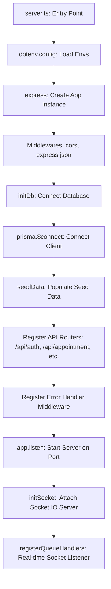
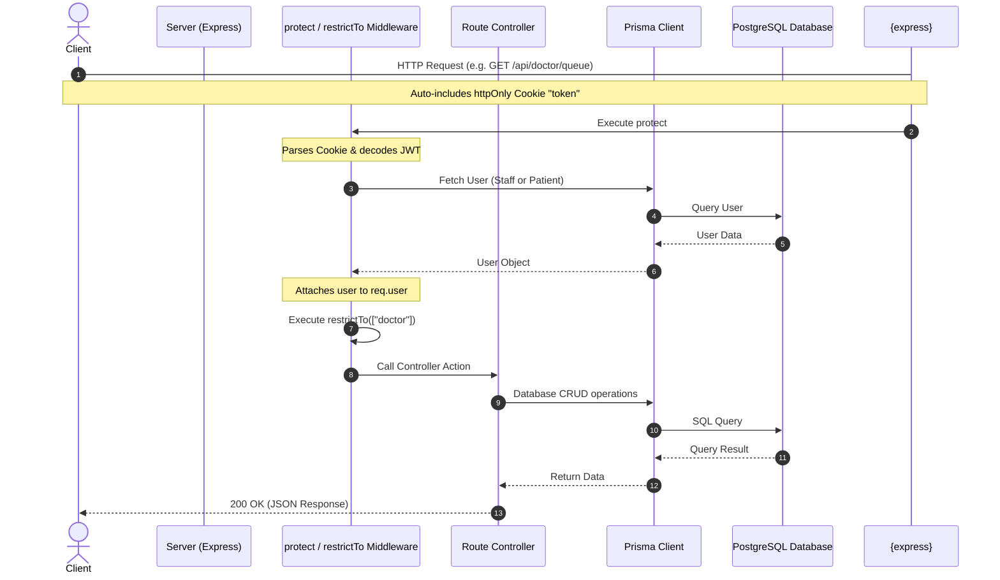

# Backend Program Flow & Architecture Documentation

Welcome to the backend documentation for the **hospital queue managegment system**. This document serves as a guide for new developers to quickly grasp the backend execution flow, request-response lifecycle, database layer, error handling, real-time sockets, and design choices.

---

## 1. Technical Stack Overview

The backend is built as a RESTful + WebSocket API using:
*   **Runtime Environment**: Node.js with TypeScript (using modern ES Modules `.js` extensions for imports).
*   **Web Framework**: Express.js (lightweight, flexible routing, and middleware ecosystem).
*   **Database Client / ORM**: Prisma ORM (provides type-safe queries and declarative schema management).
*   **Database**: PostgreSQL.
*   **Authentication**: JSON Web Token (JWT) with HTTP-Only cookie storage.
*   **Real-time Communication**: Socket.io (bi-directional event-driven sync for live queues).

---

## 2. Server Startup & Initialization Flow

The application boot sequence in [server.ts](file:///c:/Users/anike/Videos/Hospital-Appointment/Backend/src/server.ts) follows this setup order:



### Detailed Initialization Description

1.  **Environment Setup**: Envs are loaded via `dotenv.config()` from the root `.env` file.
2.  **Express App Instantiation**: An Express application instance is created, and core middleware is attached:
    *   `cors` is enabled with `credentials: true` to support HTTP-Only cookies sent from the frontend.
    *   `express.json()` handles parsing JSON request bodies.
3.  **Database Connection**:
    *   `initDb()` from [initDb.ts](file:///c:/Users/anike/Videos/Hospital-Appointment/Backend/src/database/initDb.ts) is called.
    *   It executes `prisma.$connect()` to establish a connection pool to the PostgreSQL instance.
    *   It runs `seedData()` from [seed.ts](file:///c:/Users/anike/Videos/Hospital-Appointment/Backend/src/database/seed.ts) to populate initial clinic, staff, and hospital records if they do not already exist.
4.  **Route Mounting**:
    *   If database connection succeeds, Express registers all feature routers (e.g. `/api/auth`, `/api/appointment`, etc.).
    *   It registers the global `errorHandler` middleware.
5.  **Listening and Socket Init**:
    *   `app.listen()` binds the Express app to the designated port (default: `5000`).
    *   The resulting HTTP server object is passed into `initSocket(server)` from [socketManager.ts](file:///c:/Users/anike/Videos/Hospital-Appointment/Backend/src/socket/socketManager.ts).
    *   Socket.io attaches to the HTTP server, handles connection configurations, and hooks up queue handlers (joining/leaving rooms).

---

## 3. Request-Response Lifecycle & Middlewares

Each incoming HTTP request undergoes the following lifecycle:



### Authentication & Authorization Middleware Detail

*   **`protect`** (defined in [authMiddleware.ts](file:///c:/Users/anike/Videos/Hospital-Appointment/Backend/src/middleware/authMiddleware.ts)):
    1.  Extracts the JWT token either from the `Authorization: Bearer <token>` header or the `cookie` header parsed manually (looking for `"token"`).
    2.  Verifies the token signature using the `JWT_SECRET`.
    3.  Determines the user type:
        *   If `role` in the payload is `"patient"`, it queries the `Patient` model in PostgreSQL via Prisma.
        *   If `role` is any other staff role (`ADMIN`, `DOCTOR`, `RECEPTIONIST`), it queries the `Staff` model.
    4.  Attaches the normalized user information to the request object as `req.user` (including ID, role, name, and hospital ID).
*   **`restrictTo(...roles)`**:
    1.  Checks if `req.user.role` matches any of the roles allowed to access the route.
    2.  If yes, calls `next()`. If no, immediately halts the request and forwards a `403 Forbidden` error to the error handler.

---

## 4. Key Architectural Decisions (Why We Chose This Method)

### 1. Prisma ORM (Type-Safe Database Access)
*   **The Decision**: We use Prisma ORM instead of raw PostgreSQL queries or a legacy Query Builder like Knex.
*   **Why it's better**:
    1.  **Type Safety**: Prisma automatically generates TypeScript typings based on our schema (`prisma/schema.prisma`). Every database query returns strongly-typed results, which prevents runtime bugs caused by spelling column names incorrectly or changing schema columns.
    2.  **Declarative Migrations**: Running `npx prisma migrate dev` creates chronological SQL migration scripts automatically, allowing easy team schema synchronization.

### 2. JWT Stored in HTTP-Only Cookie
*   **The Decision**: Upon successful authentication, we generate a JWT signed with a secret key and set it as an `httpOnly` cookie on the Express response.
*   **Why it's better**:
    1.  **Security**: Storing tokens in `httpOnly` cookies prevents them from being read by cross-site scripting (XSS) client-side scripts.
    2.  **Session Validity**: Setting an expiration on the cookie lets the browser handle session cleanup automatically.

### 3. Namespace Room Sockets
*   **The Decision**: Instead of broadcasting queue status changes globally to all connected socket clients, we group connections into specific rooms using `socket.join("doctor-" + doctorId)`.
*   **Why it's better**:
    *   This limits the number of socket events sent to clients. If doctor A's queue changes, only users waiting in doctor A's room receive the update, rather than pushing data to users waiting for doctor B. This prevents network congestion and scales efficiently as the clinic grows.

### 4. Centralized Error Handler Middleware
*   **The Decision**: Controllers do not send error responses directly. Instead, they capture errors (e.g. inside `try/catch` blocks) and forward them to Express's global error handler using `next(error)`.
*   **Why it's better**:
    *   Ensures that every API endpoint responds with a uniform JSON error payload format, and guarantees that server-side stack traces are logged locally but kept hidden from the public client responses in production mode for security.

---

## 5. Development Guide: How to Add Features

Here is how a new developer can add a new backend database model, routing path, controller action, and authorization check.

### Step 1: Update the Schema (If database changes are needed)
1.  Open [schema.prisma](file:///c:/Users/anike/Videos/Hospital-Appointment/Backend/prisma/schema.prisma) and add a new model:
    ```prisma
    model Prescription {
      id             String      @id @default(cuid())
      appointmentId  String      @unique
      appointment    Appointment @relation(fields: [appointmentId], references: [id])
      medicineName   String
      dosage         String
      duration       String
      createdAt      DateTime    @default(now())
    }
    ```
2.  Generate and apply the migration:
    ```bash
    npx prisma migrate dev --name init_prescription
    ```
    *(This runs the SQL scripts and regenerates the Prisma Client client libraries).*

### Step 2: Create the Controller Action
Create or modify a file inside `src/controllers/` (e.g. `prescriptionController.ts`):
```typescript
import { Response, NextFunction } from "express";
import { prisma } from "../config/db.js";
import { AuthenticatedRequest } from "../middleware/authMiddleware.js";

export const getPrescriptions = async (
    req: AuthenticatedRequest,
    res: Response,
    next: NextFunction
): Promise<void> => {
    try {
        const userId = req.user?.id; // attached by protect middleware
        
        const prescriptions = await prisma.prescription.findMany({
            where: {
                appointment: {
                    patientId: userId
                }
            }
        });

        res.status(200).json({ success: true, data: prescriptions });
    } catch (error) {
        next(error); // hands over to global errorHandler middleware
    }
};
```

### Step 3: Define Routes and Middlewares
Create a route file in `src/routes/prescriptionRoutes.ts` and set up protection:
```typescript
import { Router } from "express";
import { getPrescriptions } from "../controllers/prescriptionController.js";
import { protect, restrictTo } from "../middleware/authMiddleware.js";

export const router = Router();

// Only patients can fetch their prescription history
router.get("/my-history", protect, restrictTo("patient"), getPrescriptions);
```

### Step 4: Mount the Router
Open [server.ts](file:///c:/Users/anike/Videos/Hospital-Appointment/Backend/src/server.ts) and import your router:
```typescript
import { router as prescriptionRouter } from "./routes/prescriptionRoutes.js";

// Inside initDb().then() block:
app.use("/api/prescription", prescriptionRouter);
```
Your endpoint `GET /api/prescription/my-history` is now fully integrated, validated, authorized, and connected!
